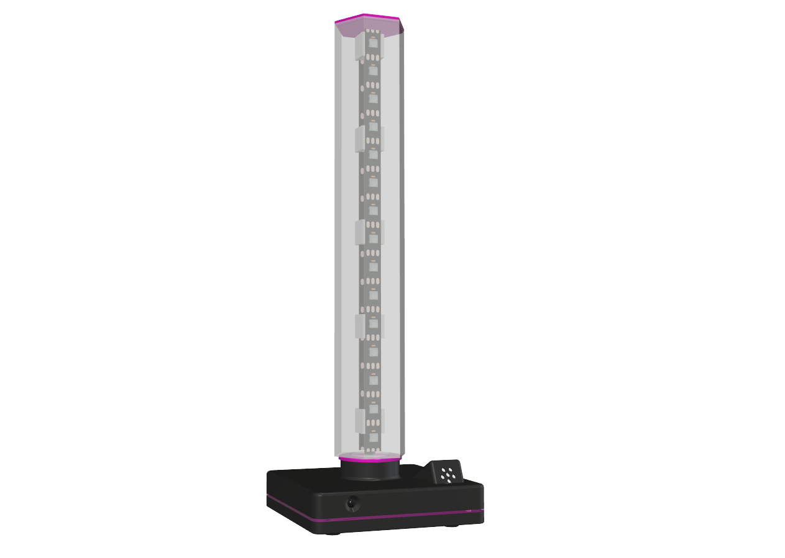

# Welcome to the YASL project



This is the firmware source code for YASL (**Y**et **A**nother **S**helf **L**amp) as published on [Thingiverse](https://www.thingiverse.com/thing:5135874) and [Thangs](https://thangs.com/technik.gegg).

This project uses an ESP8266 (Wemos D1 mini) as the controller to address and program the WS2812 (NeoPixel) LEDs. The light effects can be controlled either by a IR remote controller (RC5) or via web interface.

To compile this firmware and program it into the WEMOS D1 mini, you have to load it up in PlatformIO and run the Build/Upload commands of the WEMOS_D1 Project Task.
For the very first build you also need to "Upload Filesystem Image", since the file system contains all the files to run the web server.

It's recommended starting the **Monitor** right after your first upload of the firmware in order to retrieve the specific device name (YASL-xxxxxx).
Then take your specific IR remote control (any device that produces **RC5/RC5X** codes is suitable), point it to the IR-Receiver and press the buttons. The debug console will spit out the codes received, which you have to adopt in order to make your remote control work with the YASL.
Once you have written down your codes, open **YASL.cpp** and replace the (hex) codes in the array shown below. After this, re-compile and re-upload the firmware.

```C
uint32_t irCodes[MAX_IRCODES] {
            0x20,   // Arrow UP Button
            0x21,   // Arrow DOWN Button
            0x11,   // Arrow LEFT Button
            0x10,   // Arrow RIGHT Button
            0x2C,   // Menu Button
            0x0C,   // Power Button
            0x0D,   // Mute Button 
            0x0F,   // PiP Button (Save)
            0x2B,   // AV/TV Button (Music)
            0x0A    // Minus Button
         };
```

Keep in mind that I've implemented this code using some no-name remote for an TFT monitor I had laying around. Thus, it might not match the one you have. Although you should be able finding most of the names defined above on your remote as well. If not, remember: *Names are smoke and mirrors!*

This is what the buttons are being used for:

- **Arrow UP/DOWN** are used for browsing through the current effect (prev./next)
- **Arrow LEFT/RIGHT** are used for incrementing / decrementing the speed, palette of the current effect or the flame size in "Fire" effects
- **Power** is used for turning off / on the LEDs
- **Mute** is used to mute / unmute the microphone in Music mode
- **PiP** is used for saving all current settings onto the file system (i.e. current effect, speeds)
- **AV/TV** is used to toggle between Music mode and the last effect used
- **Minus** is used to switch direction of the flames in "Fire" effects
- **0-9** is used to switch directly to the index number of an effect (i.e. "01" for Music mode)

More buttons might be used in future versions but you could also configure some to control your own effects quickly.

From version **1.0.2** on, you have the option to enter the **Learning mode** by typing "99\<CR\>" into the monitor console. This will start a dialog which will guide you through the process of teaching the YASL new IR-Codes. Once this has sucessfully finished, codes will be saved to the file system and loaded back into memory while booting the YASL.
This mode will shut down automatically after an idle timeout of 10 seconds.
Keep in mind that the number pad isn't been tought. On a RC5/RC5X remote the numpad codes are supposed to be from 0x00 to 0x09.

---

In order to connect to the web interface, first connect to the "*YASL-xxxxxx*" AP. Then use the browser and start the web interface of the WiFi-Manager on IP-Address **192.168.4.1**.
This will start the [WiFi-Manager](https://github.com/tzapu/WiFiManager.git) which enables you to pick your local AP and enter your WiFi credentials. Once you've saved these credentials, you'll be able to connect via "http://yasl-xxxxxx.local" from your browser. Whereas the **xxxxxx** stands for the last 3 bytes of the MAC address of the according ESP8266. This will show you this web page, which basically lists the effect and the currently selected one.


Please notice that by default all YASL devices will stay in sync with the selected effect, if controlled via the web interface or a remote control - in case you have more than one device connected to your WiFI network.
If you don't want this feature, simply switch the "Sync off" for that specific device via web interface and save this setting for future use.

---

The effects you can choose from ar very well know in the NeoPixel universe. Most of them were initailly made by [Mark Kriegsman](https://github.com/kriegsman) and [Andrew Tuline](https://tuline.com), which have posted all their knowledge on the Internet.
Both fellas are a great source, if your going to implement your own effects.

For this special case, all effects have been separated into their own source/header files to make it easier finding and modifying them.
If you're about adding your own effects, simply add them in the *allEffects* collection of *effectlist.cpp*, as shown below.

```C
Effect allEffects[]  = {
    { E_FADE,           "Fade In/Out",        _FadeInOut },
    { E_MUSIC,          "Music",              _Music },
    { E_RGBLOOP,        "RGB Loop",           _RgbLoop },
    { E_CYLONBOUNCE,    "Cylon Bounce",       _CylonBounce },
    { E_METEORRAIN,     "Meteor Rain 1",      _MeteorRain1 },
    { E_TWINKLE,        "Twinkle 1",          _TwinkleRandom },
    { E_RGBNOISE,       "RGB Noise",          _FillNoise8 },
    { E_RIPPLE,         "Ripple 1",           _RipplePal },
    { E_BLENDWAVE,      "Blend Wave",         _BlendWave },
    { E_RUNNINGLIGHTS,  "Running Lights",     _RunningLights },
    { E_COLORWIPE,      "Color Wipe",         _ColorWipe },
    { E_RAINBOW,        "Rainbow",            _RainbowCycle },
    { E_THEATERCASE,    "Theater Chase 1",    _TheaterChase },
    { E_THEATERCASE2,   "Theater Chase 2",    _TheaterChaseRainbow },
    { E_FIRE,           "Fire",               _Fire },
    { E_FIRE2,          "Plasma Fire",        _Fire2 },
    { E_BOUNCINGBALLS,  "Bouncing Balls",     _BouncingColoredBalls },
    { E_METEORRAIN2,    "Meteor Rain 2",      _MeteorRain2 },
    { E_CYLONHUE,       "Cylon Hue",          _CylonHue },
    { E_RIPPLE2,        "Ripple 2",           _Ripple },
    { E_TWINKLE2,       "Twinkle 2",          _Twinkle },
    { E_WHITE,          "Solid White",        _SolidWhite  },
    { E_BLUE,           "Solid Blue",         _SolidBlue },
    { E_GREEN,          "Solid Green",        _SolidGreen },
    { E_YELLOW,         "Solid Yellow",       _SolidYellow },
    { E_RED,            "Solid Red",          _SolidRed },
    { E_ORANGE,         "Solid Orange",       _SolidOrange },
    { E_PINK,           "Solid Pink",         _SolidPink },
    { E_AQUA,           "Solid Aqua",         _SolidAqua },
    { E_PURPLE,         "Solid Purple",       _SolidPurple }
};
```

Please notice that the *displayName* defined here is the one shown on the buttons of the web interface.

Also, don't forget to add your effect to the enumeration in file *effectlist.h* **before** MAX_EFFECTS:

```C
enum _FX {
    E_FADE,
    E_MUSIC,
    ...
    E_PURPLE,
    MAX_EFFECTS
};

```

[](https://open.vscode.dev/technik-gegg/YASL/master)

---

## Recent changes

**1.0.2** - Some changes (NetBios, IR learning mode)

- added a NetBios name, so the device in question is easier to find when running on NetBios supporting networks (i.e. Windows).
- added a learning mode for other remotes. Connect to the device using the **Monitor** in VS-Code/PlatformIO then enter "99\<CR\>" to get into that mode. Read on the terminal what code is needed and press the according button on your remote.
Due to this change, the IR-Codes moved from the *Config.h* into an array, which will be saved to the file system after the teaching was successfull and loaded at every startup.
- added mode "88" (press "8" twice on your remote) to wipe out any saved WiFi network credentials. The YASL will enter AP mode on next boot (IP-Address 192.168.4.1) and you'll able to reconfigure the WiFi network it's supposed to connect to by default.
- added menu entry to webpage to turn Sync (broadcasting) on/off.

**1.0.1** - Theme replaced

- replaced the initial theme (with "Pulse" from Bootswatch.com), since it had issues showing up correctly on mobile devices. If you'd like to change the theme, install [Bootstrap-Studio](https://bootstrapstudio.io/) and open the file **YASL.bsdesign** from folder /Bootstrap-Studio. Go to *Settings->Themes* and pick the one you fancy. *Export* the files into the **/data/www** folder and re-upload the Filesystem image.

**1.0.0** - Initial commit
